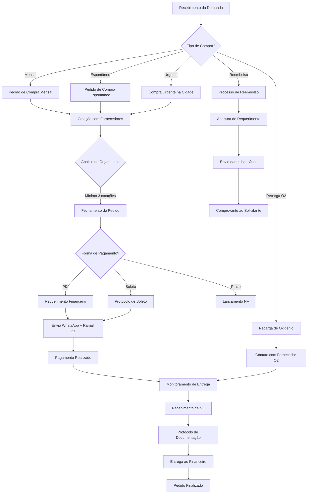

# 📊 Fluxograma Geral - Gerenciamento de Compras

## Setor: Compras
## Documento: Nº 01

---

## 🔄 Fluxo Principal de Compras



---

## 📋 Contratos de Serviço do Setor

### Contrato 01 - Pedido de Compra

| Fornecedor | Produto | Pré-requisito | Cliente |
|------------|---------|---------------|--------|
| Compras | Pedido de compra mensal | Listagem impressa com locais, valores e prazos | Estoque, Farmácia, Coordenação SAD, Captação |
| Compras | Pedido de compra espontâneo | Informação de prazo via demanda | Setores internos |

**Prazos:**
- Compras normais: 7 a 10 dias após recebimento da solicitação
- Compras em distribuidoras: Fechamento em 3 dias úteis + entrega em 2 dias úteis
- Compras urgentes: De acordo com disponibilidade do fornecedor

---

### Contrato 02 - Recargas de Oxigênio

| Fornecedor | Produto | Pré-requisito | Cliente |
|------------|---------|---------------|--------|
| Compras | Recarga de oxigênio na cidade | Informação de prazo via demanda | Hospitalar, Estoque, SAD |
| Compras | Recarga de oxigênio sede Hospitalar | Informação de prazo via demanda | Estoque |

**Prazos:**
- Cilindros para estoque: 7 dias úteis
- Urgências: De acordo com disponibilidade do fornecedor

---

### Contrato 03 - Reembolsos

| Fornecedor | Produto | Pré-requisito | Cliente |
|------------|---------|---------------|--------|
| Compras | Reembolsos | Número do requerimento com dados completos | SAD, Financeiro, Farmácia |

**Requisitos do Requerimento:**
- Nome do favorecido
- Dados bancários para pagamento
- CPF do favorecido
- Motivo da solicitação

**Entrega:** Via demanda e WhatsApp para o setor solicitante

---

### Contrato 04 - Protocolo de Documentações

| Fornecedor | Produto | Pré-requisito | Cliente |
|------------|---------|---------------|--------|
| Compras | Protocolo de documentações | Documento carimbado e assinado | Financeiro |

**Conteúdo do Protocolo:**
- Datas de vencimento
- Número da Nota Fiscal
- Quantidade de boletos
- Data da entrega ao financeiro

**Prazo de Entrega:** 7 dias de antecedência do vencimento

---

## 📊 Fluxo Visual por Etapas

### Etapa 1: Recebimento
```
┌─────────────────┐
│  DEMANDA RECEBIDA │
│  (Sistema Hospitalar) │
└────────┬────────┘
         │
         ▼
    Verificar tipo
    de solicitação
```

### Etapa 2: Cotação
```
┌─────────────────┐
│  MÍNIMO 3 COTAÇÕES │
└────────┬────────┘
         │
    ┌────┴────┐
    │         │
    ▼         ▼
 E-mail    WhatsApp
 Bionexo   Fornecedores
```

### Etapa 3: Fechamento
```
┌─────────────────┐
│ MELHOR CUSTO-BENEFÍCIO │
└────────┬────────┘
         │
         ▼
    Fechar pedido
    com fornecedor
```

### Etapa 4: Pagamento
```
┌─────────────────┐
│  FINANCEIRO (Ramal 21) │
└────────┬────────┘
         │
    ┌────┴────┐
    │         │
    ▼         ▼
   PIX     Boleto
```

### Etapa 5: Acompanhamento
```
┌─────────────────┐
│  MONITORAR ENTREGA   │
└────────┬────────┘
         │
         ▼
    Solicitar NF
    após entrega
```

### Etapa 6: Finalização
```
┌─────────────────┐
│  PROTOCOLAR E ARQUIVAR │
└─────────────────┘
```

---

## ⏱️ SLAs (Acordos de Nível de Serviço)

| Tipo de Compra | Prazo de Fechamento | Prazo de Entrega |
|----------------|---------------------|------------------|
| Mensal | Dia 12 do mês | Até dia 30/31 |
| Espontâneo | 7-10 dias | Variável |
| Distribuidoras | 3 dias úteis | 2 dias úteis |
| Urgente | Imediato | ASAP |
| Oxigênio (estoque) | - | 7 dias úteis |
| Protocolo Financeiro | - | 7 dias antes do vencimento |

---

## 📞 Canais de Comunicação

| Canal | Uso |
|-------|-----|
| Sistema Hospitalar | Demandas e Requerimentos |
| WhatsApp | Cotações e Comprovantes |
| E-mail | Fornecedores e Bionexo |
| Ramal 21 | Financeiro (urgências) |

---

*Documento baseado no Fluxograma-Compras.docx*
*Data de criação: 01/2023*
*Última atualização: 01/2026*
